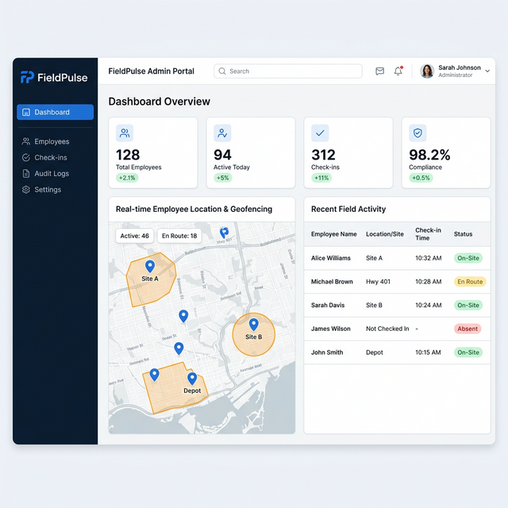

# FieldPulse Admin

FieldPulse is a premium SaaS platform for managing field workforces. This application serves as the administrative dashboard, allowing companies to track employee check-ins, enforce geo-fencing, monitor live workforce activity, and maintain immutable audit logs.



## 🚀 Key Features

- **Geo-Fenced Check-Ins**: Ensure employees can only check in within approved boundaries.
- **Real-Time Dashboard**: Live monitoring of active workforce, check-ins, and compliance status.
- **Audit Logs**: Immutable tracking of all employee updates and admin actions for accountability.
- **Multi-tenant Architecture**: Company-scoped data isolation for safety and security.

## 🛠️ Technology Stack

- **Framework**: [Next.js](https://nextjs.org/) (App Router, React 19)
- **Styling**: [Tailwind CSS 4](https://tailwindcss.com/)
- **Database / Auth**: [Firebase](https://firebase.google.com/) (Firestore, Authentication)
- **Language**: TypeScript

---

## 💻 Local Development Setup

Follow these steps to set up the project locally on your machine.

### 1. Prerequisites

Make sure you have the following installed:
- **Node.js**: v18.17 or higher (v20+ recommended)
- **npm**: v9 or higher (usually comes with Node.js)
- **Git**: For version control

### 2. Clone the Repository

Clone this repository to your local machine:

```bash
git clone https://github.com/rohans2001/FieldPulse-admin.git
cd FieldPulse-admin
```

### 3. Install Dependencies

Install all required npm packages:

```bash
npm install
```

### 4. Configure Environment Variables

The project requires Firebase configuration to connect to the database and authentication services.

Create a `.env.local` file in the root directory:

```bash
# Windows (PowerShell)
New-Item .env.local

# Mac/Linux
touch .env.local
```

Open `.env.local` and add your Firebase project keys. It should look like this:

```env
NEXT_PUBLIC_FIREBASE_API_KEY=your_api_key_here
NEXT_PUBLIC_FIREBASE_AUTH_DOMAIN=your_project_id.firebaseapp.com
NEXT_PUBLIC_FIREBASE_PROJECT_ID=your_project_id
NEXT_PUBLIC_FIREBASE_STORAGE_BUCKET=your_project_id.appspot.com
NEXT_PUBLIC_FIREBASE_MESSAGING_SENDER_ID=your_messaging_sender_id
NEXT_PUBLIC_FIREBASE_APP_ID=your_app_id
FIREBASE_CLIENT_EMAIL=your_client_email
FIREBASE_PRIVATE_KEY="your_private_key"
```
*(Note: Obtain these keys from your Firebase Console under Project Settings).*

### 5. Run the Development Server

Start the Next.js development server:

```bash
npm run dev
```

The application will be available at [http://localhost:3000](http://localhost:3000).

---

## 📁 Project Structure

```
FieldPulse-admin/
├── public/                 # Static assets (images, icons)
├── src/
│   ├── app/                # Next.js App Router
│   │   ├── (app)/          # Authenticated routes (Dashboard, Employees, Audit, etc.)
│   │   ├── login/          # Authentication page
│   │   ├── layout.tsx      # Root layout
│   │   ├── page.tsx        # Landing Page
│   │   └── landing.module.css # Styles for the landing page
│   ├── components/         # Reusable React components (UI map, tables, cards)
│   └── lib/                # Shared utilities and configurations
│       ├── firebase.ts     # Client-side Firebase init
│       └── firebaseAdmin.ts# Server-side Firebase init (optional)
├── .env.local              # Local environment variables (DO NOT COMMIT)
└── package.json            # Dependencies and scripts
```

## 📜 Available Scripts

- `npm run dev` - Starts the development server with Hot Module Replacement (HMR).
- `npm run build` - Builds the application for production deployment.
- `npm run start` - Runs the compiled production build locally.
- `npm run lint` - Runs ESLint to check for code issues.

## 🤝 Contribution Guidelines

1. Create a new branch for your feature (`git checkout -b feature/your-feature-name`)
2. Commit your changes (`git commit -m 'Add some feature'`)
3. Push to the branch (`git push origin feature/your-feature-name`)
4. Open a Pull Request

## 📄 License
This project is proprietary and confidential.
